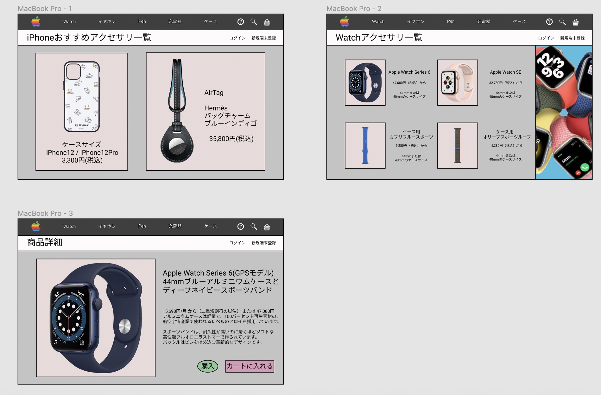

### 画面詳細図
## トップページ
### プロトタイプは以下のリンク先
[プロトタイプ](https://www.figma.com/file/AJ51K2GigkFqmzrUrfUCnE/Untitled)
*****

*****
補足：対応DBの列はDB設計後、◯を対応するテーブル・カラム名に差し替えること。
|　ID | 要素 | 内容 | アクション | イベント | 対応DB |
|----|-----|-----|---------|-------|-------|
|1|バナー|サイト名表示|-|-|-|
|2|ログイン|テキスト画像|-|-|-|
|3|ID|入力欄|テキスト入力|-|◯|
|4|PASS|入力欄|テキスト入力|-|◯|
|5|ログインボタン|ボタン|クリック|ログイン処理実行|-|
|6|新規端末登録ボタン|ボタン|クリック|登録処理実行|-|
|7|商品検索|テキスト画像|-|-|-|
|8|商品名|テキスト表示|-|-|-|
|9|商品名|入力欄|テキスト入力|-|◯|
|10|りんごマーク|ボタン|クリック|トップ画面へ遷移|◯|
|11|Watch|ボタン|クリック|Wacth詳細へ遷移|◯|
|12|イヤホン|ボタン|クリック|イヤホン詳細へ遷移|◯|
|1３|Pen|ボタン|クリック|Pen詳細へ遷移|◯|
|14|充電器|ボタン|クリック|充電器詳細へ遷移|◯|
|15|ケース|ボタン|クリック|ケース詳細へ遷移|◯|
|16|ヘルプ|画像ボタン|クリック|ヘルプ画面へ遷移|◯|
|17|検索|画像ボタン|クリック|検索画面へ遷移|◯|
|18|カート|画像ボタン|クリック|カートの中へ遷移|◯|
|19|登録情報|画像ボタン|クリック|登録情報へ遷移|◯|
|20|商品一覧|テキスト表示|-|-|○|
|21|商品画像|画像リンク|クリック|商品詳細へ遷移|◯|
|22|商品名|テキストリンク|クリック|商品詳細へ遷移|◯|
|23|価格|テキスト表示|-|-|○|
