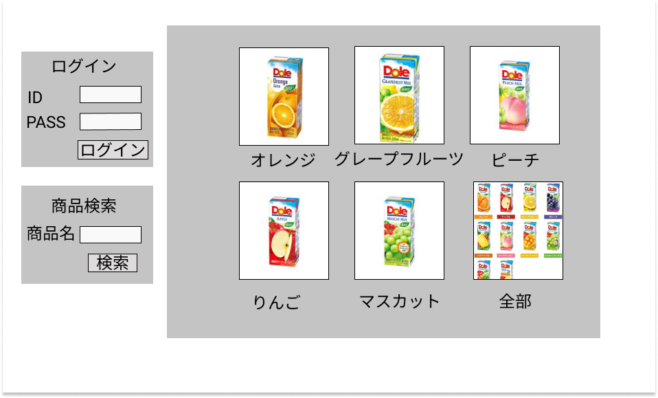

### 画面詳細図
## トップページ
### プロトタイプは以下のリンク先
[プロトタイプ](https://www.figma.com/file/pBMb8CUqc96ZoKPtK14Fhz/Untitled?node-id=1%3A2)
*****

*****
補足：対応DBの列はDB設計後、◯を対応するテーブル・カラム名に差し替えること。
|　ID | 要素 | 内容 | アクション | イベント | 対応DB |
|----|-----|-----|---------|-------|-------|
|1  |バナー|サイト名表示|-     |-       |-      |
|2  |ログイン|テキスト画像|-|-|-|
